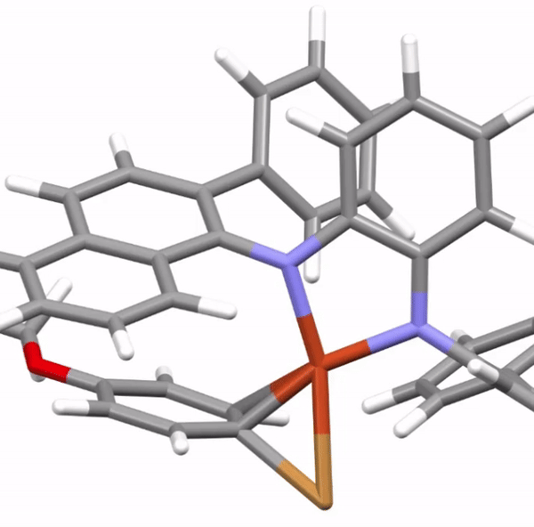
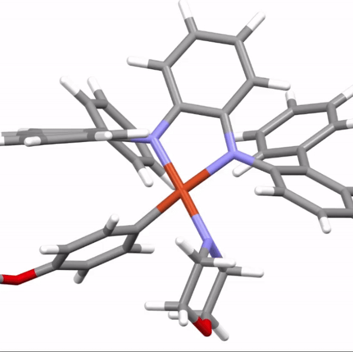
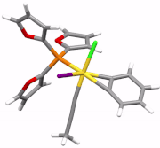
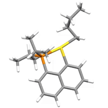

# Transition Metal version of Classy-YARP (Work in progress)
* Currently running tests and adding functions needed
* See updated wrapper functions in [reaction/](https://github.com/Savoie-Research-Group/yarp/tree/metal/reaction) and [Metal-Example/wrapper_functions/](https://github.com/Savoie-Research-Group/yarp/tree/metal/Metal-Example/wrapper_functions)
* See an example of oxidative addition [here](https://github.com/Savoie-Research-Group/yarp/tree/metal/Metal-Example/)

# See some SNAPSHOTS!
| Oxidative Addition | Reductive Elimination | Migratory Insertion | beta-Hydride Elimination |
| :---------------: | :---------------------: | :---------------------: | :---------------------: |
|  |  |  |  |

# Functionalities and Capabilities
| Classy-YARP Capabilities | |
| :---------------: | :---------------------: |
| ***Special Functionalities*** | |
| DFT job restart | :heavy_check_mark: |
| Mix Basis-set | :heavy_check_mark: |
| Full Triple-Zeta Energy Correction (for Mix Basis-set) | :heavy_check_mark: |
| Chirality Enumeration of Organometallic Ligands | :heavy_check_mark: |
| More is coming! | :arrows_counterclockwise: |
| ***Organometallic Reactions*** | |
| Oxidative Addition | :heavy_check_mark: |
| Reductive Elimination | :heavy_check_mark: |
| C-H Activation | :heavy_check_mark: |
| Migration Insertion | :heavy_check_mark: |
| beta-Hydride Elimination | :heavy_check_mark: |
| More Work in Progress! | :arrows_counterclockwise: |

